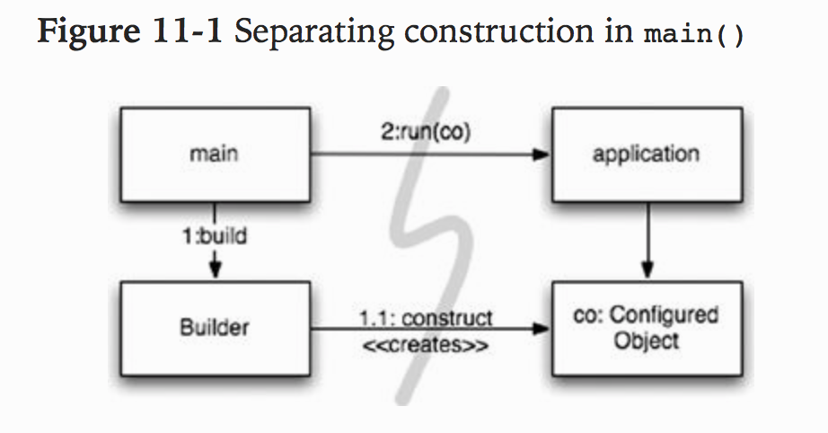

```
Complexity kills. It sucks the life out of developers, it makes products difficult to plan, build, and test
```

###### How Would You Build a City?

- Could you manage all the details yourself?
- Probably not
- Even managing a city is too much work for one person
- Yet cities work
- They work b/c cities have teams of people who manage particular parts of the city, the water systems, power systems, traffic, law enforcement, law enforcement, building codes, and so forth
- Some of those people are responsible for the `big picture`, while others focus on the details

- Cities also work b/c they have evolved appropriate levels of abstraction and modularity that make it possible for individuals and the `components` they manage to work effectively, even w/o understanding the big picture

- Although software teams are often organized like that too, the systems they work on often don't have the same separation of concerns and levels of abstraction
- Clean code helps us achieve this at lower levels of abstraction
- In this chapter let us consider how to stay clean at higher levels of abstraction, the `system` level

###### Separate Constructing a System from Using It

- Consider the `construction` is a very different process from `use`

```
Software systems should separate the startup process, when the application objects are constructed and the dependencies are "wired" together, from the runtime logic that takes over after startup
```

- The startup process is a `concern` that any app must address
- It is the first `concern` to be examined
- The `separation of concerns` is one of the oldest and most important design techniques in software

- Most applications don't separate this concern
- The code for the startup process is ad hoc and it is mixed in w/ runtime logic
- Typical example:

```
“ public Service getService() {
     if (service == null)
       service = new MyServiceImpl(…); // Good enough default for most cases?
     return service;
   }”

Excerpt From: Robert C. Martin. “The Robert C. Martin Clean Code Collection (Collection).” iBooks. 
```

- This is the `LAZY INITILIZATION/EVALUATION` idiom, and it has several merits
- Don't incur the overhead of construction unless we actually use the object, and our startup tiems can be faster as a result
- We also ensure that `null` is never returned

- However, we now have a hard-coded dependency on `MyServiceImpl` and everything its constructor requires
- Can't compile w/o resolving these dependencies, even if we never actually use an object of this type at runtime

- Testing can be a problem
- If `MyServiceImpl` is a heavyweight object, we will need to make that an appropriate `TEST DOUBLE` or `MOCK OBJECT` gets assigned to the service field before this method is called during testing
- B/c we have construction logic mixed in w/ normal runtime processing, we should test all execution paths (for example, the `null` test and its block)
- Having both of these responsibilities means that the metho dis doing more than one thing
    * We are breaking the `Single Responsibility Principle` in a small way

- Perhaps worst of al, we do not know whether `MyServiceImpl` is the right object in all cases
- Why does the class w/ this method have to know the global context? Can we `ever` really know the right objet to use here?
- Is it even possible for one type to be right for all possible contexts?

- One occurrence of `LAZY-INITILIZATION` isn't a serious problem
- However, there are normally many instances of little setup idioms like this in applications
- Hence the global setup `strategy` (if there is one) is `scattered` across the applicaiton, w/ little modularity and significant duplication

- If we are diligent about building well-formed and robust systems, we should never let little, convenient idioms lead to modularity breakdown
- The startup process of object construction and wiring is no exception
- We should modularize this process separately from the normal runtime logic and we should make sure that we hae a global, consistent strategy for resolving our major dependencies
- Runtime logic should be modularized

######## Separation of Main

- One way to separate construction from use is to move all aspects of construction to `main`, or modules called by `main`, and to design the rest of the system assuming that all objects have been constructed and wired properly (Figure 11-1)

- Flow of control is easy to follow
- `Main` builds objects necessary for system, then passes them to the application, which simply uses them
- All dependencies go away from `main`
- This means that the application has no knowledge of main or of the construction process
- Simply expects that everything has been built properly



######## Factories

- Sometimes we need to make the application responsible for `when` an object gets created

- For example, in an order processing system the application must create `LineItem` instances to add to an `Order`
- In this case we use the `Abstract Factory` pattern to give the application control of `when` to build the `LineItems`, but keep the details of that construction separate from the application code


- Notice that all dependencies point from `main` toward to `OrderProcessing` application
- Application is decoupled from the details of how to build a `LineItem`
- That capability is held in the `LineItemFactoryImplementation` which is on the `main` side of the line
- Application is in complete control of when the `LineItem` instances get built and can even provide application-specific constructor arguments

######## Dependency Injection

- Powerful mechanism for separating construction from use is `Dependency Injection` (DI), the application of `Inversion of Control` (IOC) to dependency management
- Inversion of Control moves secondary responsibilities from an object to other objects that are dedicated to the purpose, thereby supporting the `Single Responsibility Principle`
- In dependency management, an object should not take responsibility for instantiating dependencies itself
- Instead it should pass this responsibility to another `authoritative` mechanism, thereby inverting the control
- B/c setup is a global concern, this authoritative mechanism will usually be either the `main` routine or a special-purpose `container`

- JDNI lookups are a `partial` implementation of DI, where an object asks a directory server to provide a `service` matching a particular name

Java example:

```
“MyService myService = (MyService)(jndiContext.lookup(“NameOfMyService”));”

Excerpt From: Robert C. Martin. “The Robert C. Martin Clean Code Collection (Collection).” iBooks.
```

- The invoking ojbect doesn't control what kind of object is actually returned, but the invoking object still actively resolves the dependency

- True DI goes one step further
- The class takes no direct steps to resolve its dependencies; it is completely passive
- Instead, it provides setter methods or constructor arguments (or both) that are used to `inject` the dependencies
- During the construction process, the DI container instantiates the required objects (usually on demand) and uses to constructor arguments or setter methods provided to wire together the dependencies
- Which dependent objects are actually used is specified through a configuration file or programmatically in a special-purpose construction file

###### Scaling Up

- `It is a myth that we can get systems right the first time`
- We should only implement today's `stories`, then refactor and expand the system to implement new stories tomorrow
- This is the essence of iterative and incremental agility
- TDD, refactoring, and the clean code they procude make this work at the code level

```
Software systems are unique compared to physical systems. Their architectures can grow incrementally, if we maintain the proper separation of concerns
```

