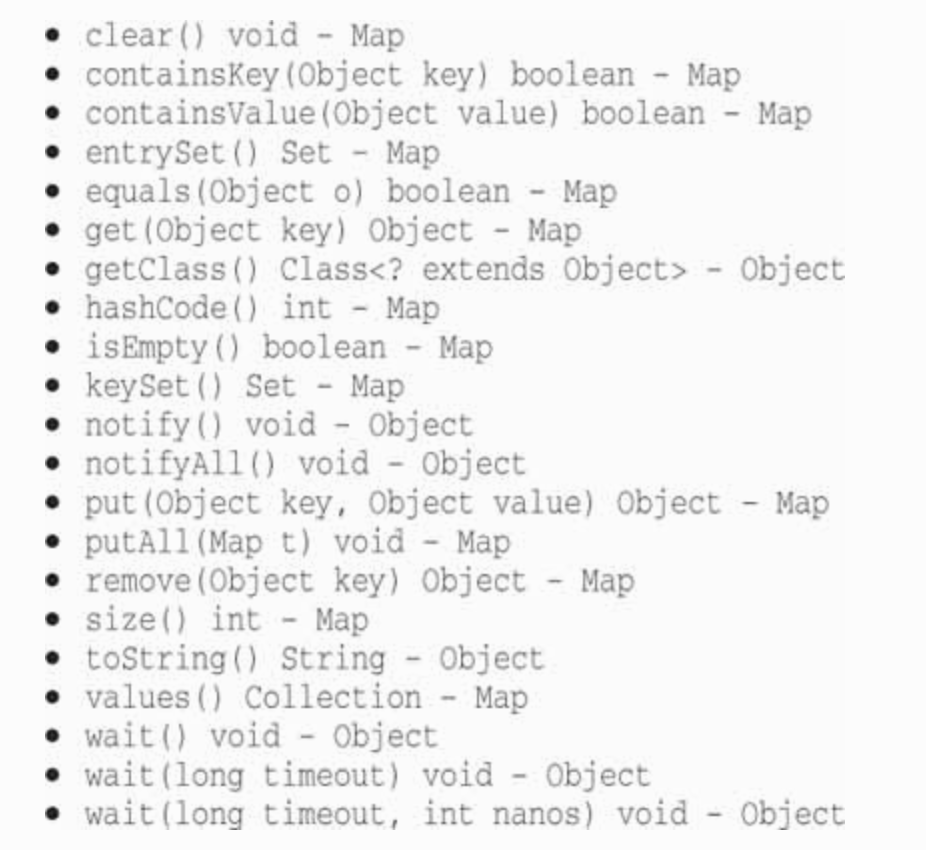
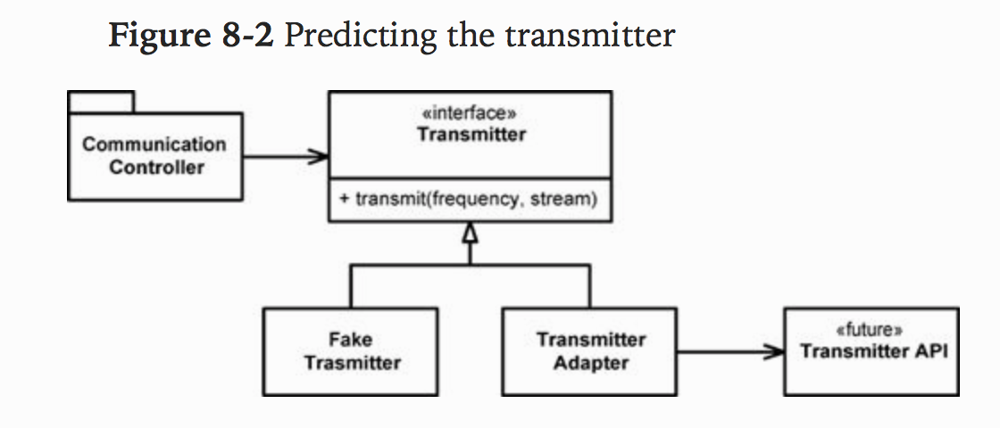

- Seldom control all software in our systems
- Must cleanly integrate foreign code w/ our own

###### Using 3rd Party Code

- Natural tension btwn provider of an interface and the user of an interface
- Providers of 3rd party packages and frameworks strive for broad applicability so they can work in many environments and appeal to a wide audience
- Users, on the other hand, want an interface that is focused on their particular needs
- This tension can cause problems at the boundaries of our systems

- `java.util.Map` as an example
- Figure 8.1 - Maps have a broad interface w/ plenty of capabilities
- Power and flexibility is useful, but it can be a liability
- For example, app might build up a `Map` and pass it around
    * Intention might be that none of the recipients of our `Map` delete anything in the map
    * But the method is still available anyways as the `clear()` method
    * Any user of the `Map` has the power to clear it
- Our maybe our design convention is that only particular types of objects can be stored in `Map`, but `Maps` do not reliabily constrain the types of objects placed within them
    * Any determined user can add items of any type of any `Map`



- If our application needs a `Map` of `Sensors`, you might find the sensors set up like this

`Map sensors = new HashMap();`

- Then when some other part of the code needs to access the sensor, you see this code

`Sensor s = (Sensor)sensors.get(sensorId);`

- We don't just see it once, but over and over again throughout the code
- The client of this code carries the responsibility of getting an `Object` from the `Map` and casting it to the right type
- This works, but `it is not clean code`
- Also, this code does not tell its story as well as it could
- The readbility of this code can be greatly impored by using generics, as shown below

` Map<Sensor> sensors = new HashMap<Sensor>();`
-Now we can do
` Sensor s = sensors.get(sensorId);`

- This doesn't solve the problem that `Map<Sensor>` provides more capability than we need or want

- Passing an instance of `Map<Sensor>` liberally around the system means that there will be a lot of places to fix if the interface to `Map` ever changes
- You might think such a change to be unlikely, but remember that it changed when generics support was added in Java 5
- Seen systems that are inhibited from using generics b/c of the sheer magnitude of changes needed to make up for the liberal use of `Maps`

- A cleaner way to use `Map` might look like the following
- No user of `Sensors` would care one bit if generics were used or not
- That choice is an implementation detail

```
“public class Sensors {
     private Map sensors = new HashMap();

     public Sensor getById(String id) {
       return (Sensor) sensors.get(id);
     }

     //snip
   }
”

Excerpt From: Robert C. Martin. “The Robert C. Martin Clean Code Collection (Collection).” iBooks. 
```

- The interace at the boundary (Map) is hidden
- It is able to evolve w/ very little impact on the rest of the application
- The use of generics is no longer a big issue b/c the casting and type management is handled inside the `Sensors` class

- This interface is also tailored and constrained to meet the needs of the application
- It results in code that is easier to understand and harder to misuse
- The `Sensors` class can enforce design and business clues

- Nto suggesting that every use of `Map` be encapsulated in ths form
- `Advusubg you to not pass Maps (or any other interface at a boundary) around your system`
- If you use a boundary interface like `Map`, keep it inside the class, or close family of classes, where it is used
- Avoid returning it from, or accepting it as an argument to, public APIs

###### Exploring and Learning Boundaries

- 3rd party code helps us get more functionality delievered in less time

- Suppose it is not clear how to use a 3rd party library
- Learning 3rd party code is hard
- Integrating the 3rd party code is hard too
- Instead of experimenting and trying out the new stuff in our prod code, we could write some tests to explore our understanding of the 3rd party code
    * `Learning tests`

- In learning tests, we call the 3rd party API, as we expect to use it in our application
- Doing controlled experiments that check our under

###### Learning Tests Are Better Than Free

- The learning tests cost nothing
- We had to learn API anyway, and writing those tests was an easy and isolated way to get that knowledge

- Have a positive return on investment
- When there are new releases of the 3rd party package, we run the learning tests to see whether there are behavior differences

- Learning tests verify that the 3rd party packages we are using work the way we expect them to
- Once intergrated, there are no guarantees that the 3rd party code will stay compatible with our needs
- With each new release comes risk
- Learning tests limit these risks

- Whether you need the learning provided by the learning tests or not, a clean boundary should be supported by a set of outbound tests that exercise the interface the same way the production code does
- W/o these `boundary tests` to ease the migration, we might be tempted to stay with the old version longer than we should

###### Using Code That Does Not Yet Exist

- Another kind of boundary, one that separates the known from the unknown
- There are often places in the code where our knowledge seems to drop off the edge
- Sometimes what is on the other side of the bundary is unknowable (at least right now)

Example from Author

- Number of years ago part of team developing software for a radio communications systm
- There was a subsystem, the `Transmitter`, that little was known about
    * People responsible for the subsystem had not gtten to the point of defining the interface
    * Did not want to be blocked, so started work far away from unkown part of the ocde

- had pretty good idea where known world ended and the new world began
- As we worked, we sometimes bumped up against this boundary
- Through mists and clouds of ignorance obscured our view beyond the boundary, our work made us aware of what we `wanted` the boundary interface to be
- We wanted to tell the transmitter something like this:
```
Key the transmitter on the provided frequency and emit an analog representation of the data coming from this stream
```

- Had no idea how that would be done b/c the API had not been designed yet
- So decided to work out the details later

- To keep from being blocked, we defined our own interface
- Called it `Transmitter`
- Gave it a method called `transmit` that took a frequency and a data stream
- This was the interface we `wished` we had

- One good thing about writing the interface we wish we had is that it's under our control
- This helps keep client code more readable and focused on what it's trying to accomplish

- In Figure 8-2, you can see that we insulated the `CommunicationsController` classes from the transmitter API (which was out of our control and undefined)
- By using our own application specific interface, we kept our `CommunicationController` code clean and expressive
- Once the transmitter API was defined, we wrote the `TransmitterAdapter` to bridge the gap
- The `ADAPTER` encapsulated the interaction w/ the API and provides a single place to change when the API evolves



- THis design also gives us a convenient seam in the code for testing
- Using a suitable `FakeTransmitter`, we can test the `CommunicationsController` classes
- Can also create boundary tests once we have the `TransmitterAPI` that make sure we are using the API correctly

###### Clean Boundaries

- Change happens at boundaries
- Good software design accomodates change w/o huge investments and rework
- When we use code that is out of our control, special care must be taken to protect our investment and make sure future change is not too costly

- Code at boundaries needs clear separation and tests that define expectations 
- Should avoid letting too much of our code know about the 3rd party particulars
- It's better to depend on something you control than something you don't control, lest it end up controlling you

- We manage 3rd party boundaries by having very few places in the code that refer to them
- We may wrap them as we did with `Map` or we may use an `ADAPTER` to convert from our perfect interface to the provided interface
- Either way our code speaks to us better, promotes internally consistent usage across the boundary, and has fewer maintenance points when the 3rd party code changes

